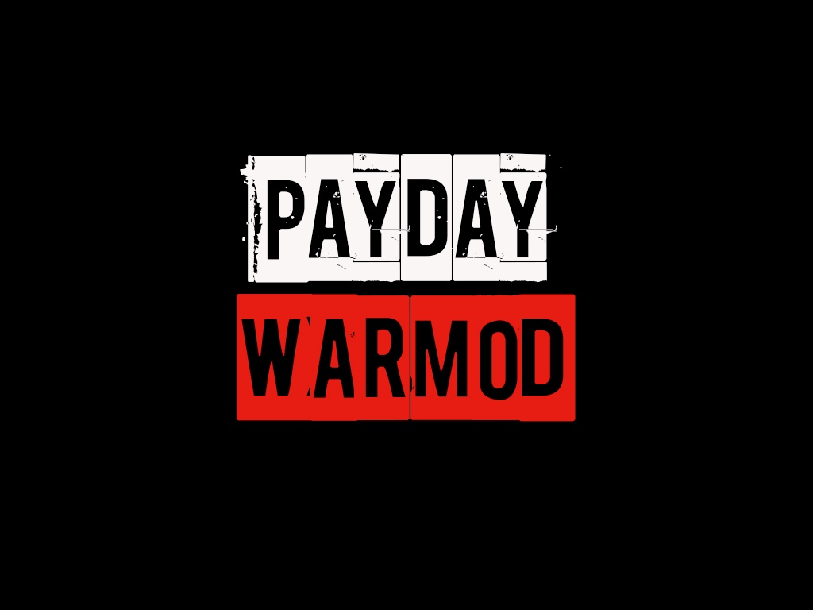
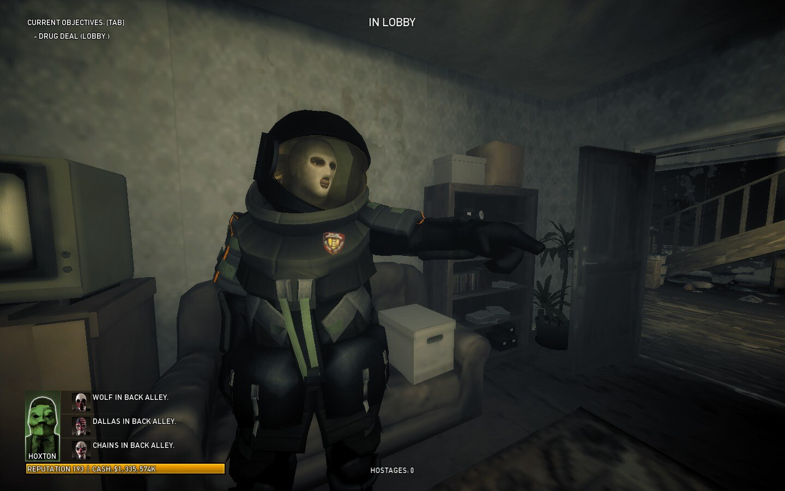
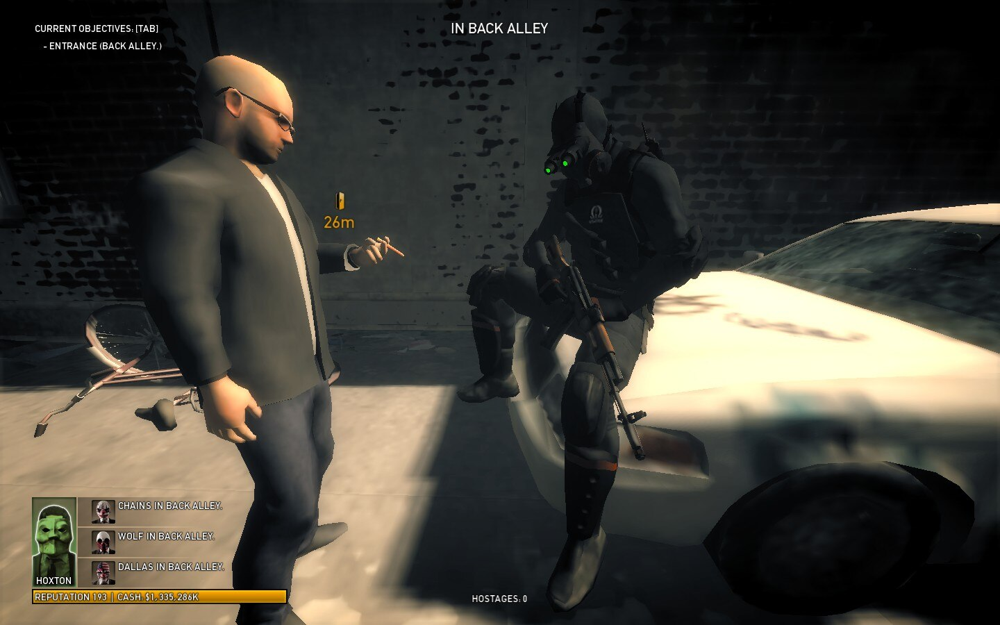
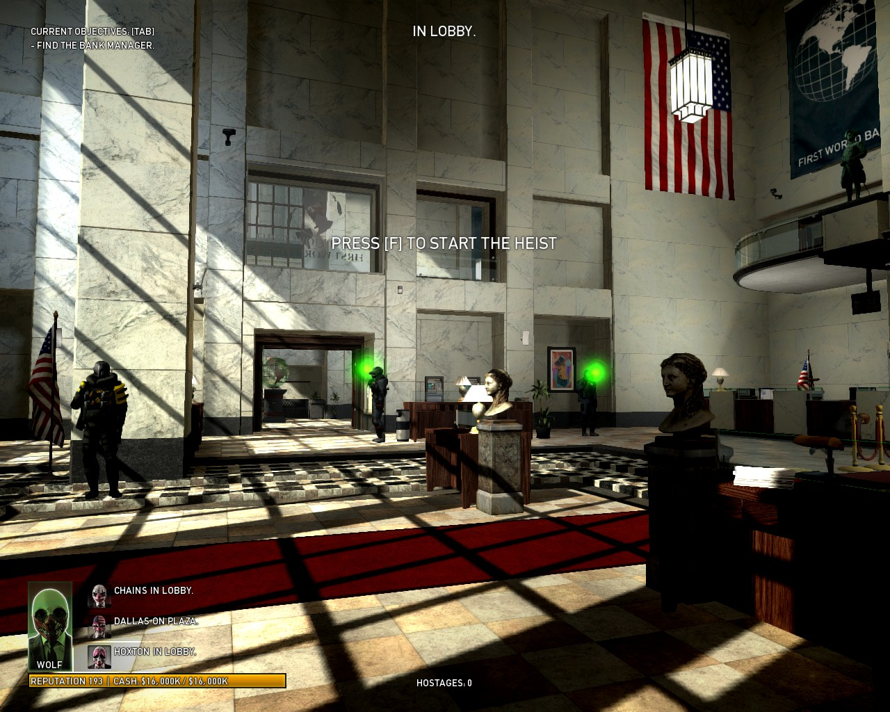

# Warmod
Payday The Heist Warmod 
https://modworkshop.net/mod/35091

Description:

This mod provides you some features to make your gameplay much more challenging. Because the vanilla game is so easy and boring, right?
The basic features are:
Changing enemies spawn logic. Now they will spawn exactly in that location where you are.
Decreasing enemies spawn delay. Now you don’t have to waste time waiting them to respawn :)
Changing enemies behaviour logic.
Changing spawn tables. This means the game can spawn stronger enemies instead of weak ones. Heavy SWATs instead of cops for instance.
Changing weapons used by enemies.

You can rewrite the script elements of each map (for example, energy and water elements is rewritten on the "counterfit" map. Part of the gameplay has been rewritten. Thus, on the counterfeit map, the logic of electric boxes and reels has been changed.

SETUP and EDIT:

if you want to play with this, you need to setup DAHM platform. After you need to copy the warmod folder to the "mods" folder.
How edit mod settings? - in warmod folder, open "configs" folder. And you can open 4 cfg:
eventlist.lua - event config( activate vault bulldozers on all diff, activate energy on countefeit and etc.. )
spawnlist.lua - change spawn enemy table( gensec on cloaker, shield, sniper )
weaponlist.lua - change weapons enemy( add bulldozer ak )
warmodcfg.lua - there you can activate/disable all mod functions.
WarmodCFG.EnableUniqueCopLogic - The police are much more dangerous now

!You should open cfg with "Notepad++" program, and edit cfg with encoding "utf-8" without BOOM.
But, i think, standart notepad you can use too ( It was noticed that due to the inappropriate encoding, the scripts were not readable by the game, That is why I advise you to use Notepad++ and edit the config with utf-8 encoding without BOOM ).

The mod complicates the gameplay precisely thanks to the introduced navigation (The police always know where the player is, and no one will be able to sit out, they will come for everyone. The situation becomes more complicated if the spawn graph is modified on the map. It is not working on all maps, but it feels very good on first world bank.

Works with DorHUD module 
https://modworkshop.net/mod/14267

Group:

https://steamcommunity.com/groups/bWarmod

Authors:

https://steamcommunity.com/id/bXana/
https://steamcommunity.com/profiles/76561198120924534

Testers:

https://steamcommunity.com/profiles/76561198169932167
https://steamcommunity.com/id/Cloaker_Hater
